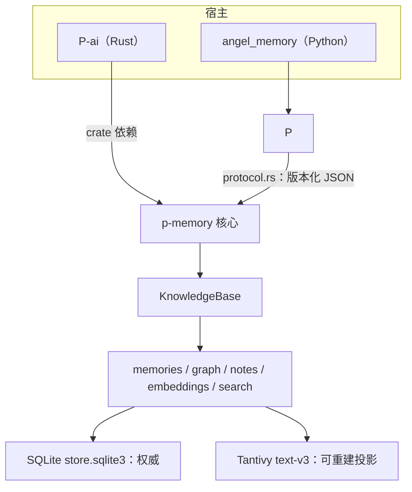
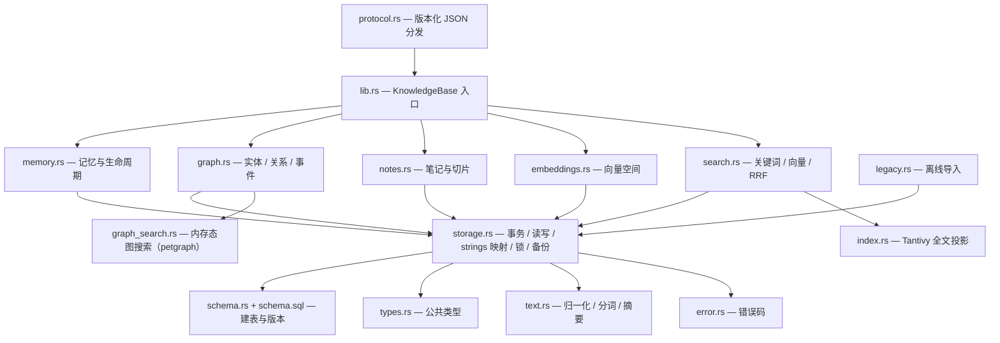
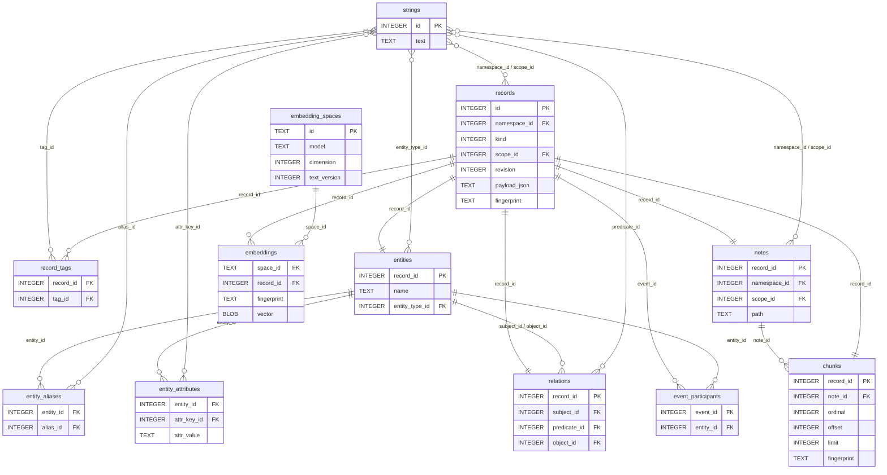
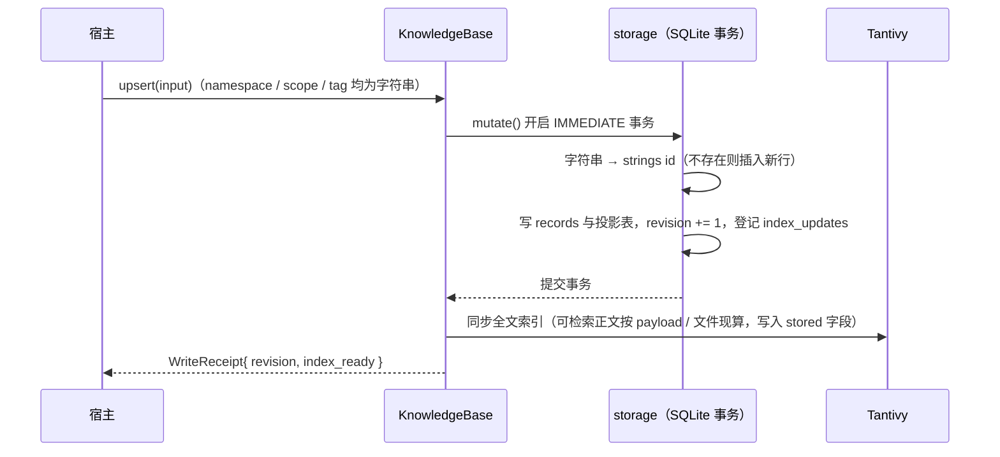

# 架构

本文件说明 p-memory 的架构：分层、模块、数据表关系与关键时序。

## 1. 系统分层

- Rust 宿主直接依赖核心 crate；Python 宿主经 `p_memory` 绑定，绑定只做类型转换并把调用交给 `protocol.rs` 的 JSON 分发。
- 存储分层与权威关系见 [overview](overview.md)。

## 2. 核心模块

| 模块 | 职责 |
|---|---|
| `lib.rs` | 唯一入口 `KnowledgeBase`，聚合五个域 |
| `storage.rs` | 事务封装、记录读写、读连接池（空闲复用 / 池空新建）、向量分区缓存、`strings` 字典映射、写锁、备份恢复 |
| `types.rs` | `RecordInput`/`RecordHeader`/`ReadFilter`/`PageRequest`/`WriteReceipt`/`Evidence` |
| `text.rs` | 归一化、CJK 分词、内容摘要 |
| `error.rs` | 错误类型与错误码 |
| `schema.rs` / `schema.sql` | 建表语句、schema 版本、初始化 |
| `memory.rs` / `graph.rs` / `notes.rs` / `embeddings.rs` / `search.rs` | 五个领域 |
| `index.rs` | Tantivy 全文投影，可重放 |
| `graph_search.rs` | 内存态图搜索：按 `ReadFilter` 读一次快照建 petgraph 图，补虚拟边与 `sys:same_as` 缩点，用完即弃 |
| `legacy.rs` | 三来源离线导入 |
| `protocol.rs` | 给薄绑定用的版本化 JSON 边界，只解码与分发 |

## 3. 数据表关系

`strings` 是唯一的字典表：所有会重复出现的标记（tag、namespace、scope、entity_type、predicate、attr_key、source，以及 payload 内的 `memory_type`）都只把文本存这一份，别处只存整数 id。`kind` 是编译期可穷举的固定枚举，直接存整数、不建表。

关键点：

- `records` 是所有领域的宽表，主键 `id` 自增整数，与任何外部 ID 无关；`kind` 区分领域。领域正文的权威：记忆在 `payload_json` 的 `judgment`，笔记在宿主文件（`payload_json` 只留切片粒度，路径在 `notes` 表）。记忆的 `memory_type` 也以 `memory_type_id` 存在 payload 内，指向 `strings`，读取时还原文本。
- 可检索正文与向量输入都是**派生文本**，不落 SQLite 列：写入时按 `kind` 从 payload（笔记则读文件）现算，可检索正文交给 Tantivy 的 stored 字段。
- 各领域投影表（`entities`/`relations`/`notes`/`chunks` 等）的 `record_id` 直接复用 `records.id`，靠外键与级联删除维持一致性。
- 笔记的路径只在 `notes` 表存一次（→strings）；标题由路径派生。`chunks` 不重复携带正文，只存 `note_id` 与行/字符区间，切片正文按区间从文件原文取出。
- `chunks.fingerprint` 保留「内容未变则复用向量」的语义：`ordinal` 与内容都没变的切片复用原 `record_id`，向量继续有效。
- `embedding_spaces` 的 `id` 是文本（模型标识），`embeddings` 是「空间 × 记录」的复合主键。
- `index_updates`、`import_runs`、`meta` 是辅助表：索引重放日志、导入批次指纹、修订号计数器。

## 4. 一次写入的时序

调用方报字符串，核心在存储层内部换算成 id。

- 数据提交与索引更新分离：事务先提交，再写索引。`index_ready=false` 只表示索引未同步，数据仍然已提交。
