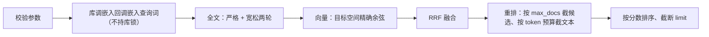

# 检索

检索由 `KnowledgeBase::search` 统一入口提供，支持关键词、向量和两者混合，并可选重排。全部过滤条件在截取 Top-K **之前**应用。

向量化由库内部完成：宿主只给搜索词与目标空间，库用它注册的回调嵌入查询词——宿主不接触向量。

## 请求

```rust
struct SearchRequest {
    query: String,                    // 关键词查询，必填
    filter: ReadFilter,               // 命名空间、作用域、标签
    kinds: Vec<RecordKind>,           // 默认 memory/entity/relation/event/chunk
    limit: usize,                     // 默认 10，范围 1..=10000
    candidate_limit: Option<usize>,   // 各路召回上限
    embed_space: Option<String>,      // 走向量路时用哪条向量空间
    text_weight: f64,                 // 默认 1.0，须为正有限值
    prune: Option<GraphPrune>,        // Graph-First 剪枝，None 为全量检索
    text: bool,                       // 默认 true，本次是否走全文路
    vector: bool,                     // 默认 true，本次是否走向量路（需要 embed_space）
    rerank: bool,                     // 默认 true，本次是否重排（未注册回调时被忽略）
    with_total: bool,                 // 默认 false，是否返回过滤后的匹配总量
}

struct GraphPrune { root: i64, depth: usize, limit: usize }
```

约束：

- `query` 不能为空，否则 `validation`。
- 向量能力由库承担，宿主始终提供关键词，不传向量。
- 向量路要同时满足「`vector` 为真」与「给出 `embed_space`」；缺任一条件就不走向量路，**不是错误**。两条路都关（`text=false` 且 `vector` 无效）才报 `validation`。
- `candidate_limit` 缺省为 `(limit * 5).max(100).min(10000)`，且不得小于 `limit`。
- `prune.depth` 至少为 1、`prune.limit` 至少为 1，否则 `validation`。

## 返回

```rust
struct SearchHit {
    key: RecordKey,
    score: f64,                        // RRF 融合分，非概率
    text_score: Option<f64>,          // 全文原始分
    vector_scores: Map<String, f64>,  // 各向量空间的余弦分
    rerank_score: Option<f64>,        // 本条目在重排回调那里的分数；未重排为 None
    record: Value,                    // 完整记录
}
struct SearchResult {
    hits: Vec<SearchHit>,
    revision: i64,
    indexed_revision: i64,
    total: Option<usize>,             // 过滤之后、截断之前的匹配数；with_total=false 时为 None
    diagnostics: SearchDiagnostics,
}
struct SearchDiagnostics {
    text_used: bool, vector_used: bool, reranked: bool,
    rerank_candidates: usize,         // 实际送入重排回调的候选数
    rerank_truncated: usize,          // 因 max_docs 未送入重排的候选数
    degraded: Vec<Degrade>,           // 本次落在了哪几档降级
}
```

## 命中附带上下文

`search_with_context(request, limit)` 先走一遍 `search`，再给每条命中挂上它的实体邻域：

```rust
struct ContextualHit { hit: SearchHit, context: Neighborhood }   // Neighborhood { entities, relations }
```

「挂载」的判定：命中记录所带的 tag，若与**同一 namespace / scope 内**某实体的名字或别名文本相同，就认为该记录挂在这个实体上——两者都落在 `strings` 表、同一套归一化，直接按文本相等 join。领域边界只由 namespace / scope 决定，tag 只用来找实体、不反过来筛实体。`limit` 是每个实体邻域的规模上限；命中记录没挂到任何实体时，`context` 为空。

## 执行流程



1. **校验参数**，任何非法立即返回 `validation`。
2. **嵌入查询词**：走向量路时，库取目标空间注册的回调嵌入查询词。这是模型往返，在取库锁之前完成。
3. **同步索引**：`query` 非空时先补齐待处理的全文更新，绝不静默使用旧索引。
4. **全文召回**：严格与宽松两轮，详见下节。
5. **向量召回**：加载目标空间并精算余弦。若给了 `prune`，先按 `root` 在图里展开 `depth` 跳取邻域（含起点，节点上限 `limit`），向量打分只在这些 `record_id` 内进行——图外的记录不参与打分；未设 `prune` 时保持全量行为。邻域按 `predicate_rules` 补过对称/逆关系、并按 `sys:same_as` 缩点，详见 [graph-search](graph-search.md)。
6. **RRF 融合**：每一路按名次贡献 `weight / (60 + rank + 1)`，其中 `rank` 从 0 计。文本路权重为 `text_weight`，向量路权重固定为 1。
7. **重排**：注册了重排回调且 `rerank=true` 时，按 RRF 顺序把候选截到 `max_docs`，文档与查询词按 token 预算截断后交给回调；回调返回的分数替换 RRF 分参与排序。截断数量写进诊断。
8. **排序截断**：重排分（或 RRF 分）降序，同分按 `RecordKey` 升序，取前 `limit`。

## 全文检索

分词流程：

- `normalize_text`：去首尾空白、全角转半角、弯引号转直引号、统一小写。
- `tokenize`：英文与数字按词切分；CJK 序列同时产出**单字**与相邻**双字（bigram）**。
- `query_terms`：查询侧去重；严格模式移除纯 CJK 双字（仅保留单字），宽松模式保留。
- `truncate_to_tokens`：按同一套 token 计数把文本截到预算内，重排与嵌入的截断都用它。

两轮召回：

| 轮次 | 逻辑 | 作用 |
|---|---|---|
| 严格 | 全部词项 `Must` 命中 | 精确匹配优先 |
| 宽松 | 词项 `Should` 命中 | 补充召回 |

结果合并时**严格轮优先**：先取严格命中，再用宽松结果补齐未出现的记录，最后按组内分数与 `key` 排序。索引侧 schema 为 `key/namespace/scope/kind/tags/keywords/text/body`：`text` 使用预切分的空白分词器（`pretokenized`）承担正文 1+2 分词召回；`body` 是同一段未分词正文的 stored 字段，供重排取候选正文与命中回读，索引不可用时改由 payload 现算；`tags` 与 `keywords` 是精确整词字段（`STRING`），`keywords` 收纳各记录的 tags 与笔记 `source` 的各级父目录名，查询时按整词与正文并行 `Should` 召回——打关键字即能命中，且专有名词不被切碎。

## 向量检索

- 每个向量空间在内存中维护一份 `VectorMatrix`（按空间缓存，写入提交后清空）。
- 精确计算余弦相似度；查询向量先归一化，存储向量写入时已归一化。
- 用**有界堆**保留 Top-K。
- 检索为**精确检索**，不做近似索引。

## 重排

- 重排回调是进程内单例，不绑定向量空间：`rerank(query, documents) -> [score]`，与输入文档等长、按序给出。
- 库在调用前按 `RerankerOptions` 强制截断：候选截到 `max_docs`，文档按 `max_tokens_per_doc`、查询词按 `max_tokens_query` 截断。重排模型普遍有硬上限，超出的候选不是变慢就是直接报错。
- 回调失败或返回条数/有限性不符时，按融合分排序并记 `Degrade::RerankFailed`，不抛错。

## 降级

多档是多个失效点各自有退路，且每一档都可观测：

| 档位 | 触发 | Degrade |
|---|---|---|
| 纯全文 | 该 namespace 关了向量化 | `namespace_disabled` |
| 纯全文 | 目标空间没注册嵌入回调 | `no_embedder` |
| 纯全文 | 嵌入回调调用失败 | `embed_failed` |
| 按融合分排序 | 重排回调失败或产出不符 | `rerank_failed` |
| 文本路不可用 | 索引查询失败，且当场重建仍未能恢复 | `text_index_unavailable` |

任一档都返回结果、不抛错、不返回空；当前档位可从 `SearchResult.diagnostics.degraded` 与 `HealthReport.last_degraded` 读到。索引查询失败不是直接降级：检索会先按 `FORMAT` 与权威数据当场重建索引并重试，只有重建仍失败时才隔离文本路。

## 过滤

- 命名空间、作用域、记录类型、标签（AND、归一化、大小写不敏感）在构造查询或打分前统一应用。
- 图谱展开（`neighbors`/`events_for_entity`）遵守同样的作用域约束：标签只约束返回的关系，作用域同时约束端点实体。
- 向量路径按 `row.key.namespace`、`row.scope`、`kinds`、`row.tags` 在打分前过滤。

## 索引一致性

- SQLite 与 Tantivy 之间用可重放的 `index_updates` 日志衔接，每条日志记录 `(revision, record_id)`：
  `revision` 既是主键也是重放游标，`record_id` 指向待同步的那条记录。
- 索引提交带 payload `p-memory-text-v3:<indexed_revision>`；`open` 时若 payload 与 `indexed_revision` 不符即整体重建。
- 索引目录损坏时**隔离并重建**：把 `text-v2` 重命名为 `text-v2.corrupt-<uuid>`，再新建空索引，权威数据库不受影响。
- 检索前若有待处理更新会先重放，保证结果与已提交数据一致。
