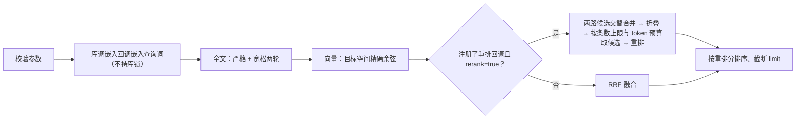

# 检索

检索由 `KnowledgeBase::search` 统一入口提供，支持关键词、向量和两者混合，并可选重排。全部过滤条件在截取 Top-K **之前**应用。

向量化由库内部完成：宿主只给搜索词与目标空间，库用它注册的回调嵌入查询词——宿主不接触向量。

## 请求

```rust
struct SearchRequest {
    query: String,                    // 关键词查询，必填
    filter: ReadFilter,               // 命名空间、作用域、标签、笔记
    kinds: Vec<RecordKind>,           // 默认 memory/entity/relation/event/chunk
    limit: usize,                     // 默认 10，范围 1..=10000
    candidate_limit: Option<usize>,   // 各路召回上限
    embed_space: Option<String>,      // 走向量路时用哪条向量空间
    text_weight: f64,                 // 默认 1.0，须为正有限值
    prune: Option<GraphPrune>,        // Graph-First 剪枝，None 为全量检索
    text: bool,                       // 默认 true，本次是否走全文路
    vector: bool,                     // 默认 true，本次是否走向量路（需要 embed_space）
    rerank: bool,                     // 默认 true，本次是否重排（未注册回调时被忽略）
    with_total: bool,                 // 默认 false，是否返回过滤后的匹配总量
    match_field: MatchField,          // 默认 all，本次全文路限定在哪一列命中
    top_chunks_per_note: usize,       // 默认 3，折叠后每条命中最多聚合这一篇在候选窗口内的几片；0 为不聚合
}

enum MatchField {                     // 序列化为 all / text / name / path
    All,                              // 默认：正文列 + 名字列，任一命中即算
    Text,                             // 只正文列
    Name,                             // 只名字列（实体规范名、笔记文件名）
    Path,                             // 只目录列（笔记所在目录段），供「书名块不够」的兜底用
}

struct GraphPrune { root: i64, depth: usize, limit: usize }
```

约束：

- `query` 不能为空，否则 `validation`。
- 向量能力由库承担，宿主始终提供关键词，不传向量。
- 向量路要同时满足「`vector` 为真」与「给出 `embed_space`」；缺任一条件就不走向量路，**不是错误**。两条路都关（`text=false` 且 `vector` 无效）才报 `validation`。
- `candidate_limit` 缺省为 `(limit * 5).max(1000).min(10000)`，且不得小于 `limit`。
- `prune.depth` 至少为 1、`prune.limit` 至少为 1，否则 `validation`。

## 返回

```rust
struct SearchHit {
    key: RecordKey,
    score: f64,                        // RRF 融合分，非概率
    text_score: Option<f64>,          // 全文原始分
    vector_scores: Map<String, f64>,  // 各向量空间的余弦分
    rerank_score: Option<f64>,        // 本条目在重排回调那里的分数；未重排为 None
    note_chunks: Option<usize>,       // 本条是切片时：所属笔记里命中本次查询的切片总数（含本条）
    top_chunks: Vec<ChunkRef>,        // 本条代表的那一篇里排名最高的若干片，第 0 条就是本条自身
    record: Value,                    // 完整记录
}
struct ChunkRef { id: i64, offset: usize }   // 片段定位：记录 id 与在原文里的起始行（1 起）
struct SearchResult {
    hits: Vec<SearchHit>,
    revision: i64,
    indexed_revision: i64,
    total: Option<usize>,             // 过滤之后、截断之前的匹配数；with_total=false 时为 None
    diagnostics: SearchDiagnostics,
}
struct SearchDiagnostics {
    text_used: bool, vector_used: bool, reranked: bool,
    rerank_candidates: usize,         // 实际送入重排回调的候选数
    rerank_truncated: usize,          // 因条数上限或 token 预算未送入重排的候选数
    degraded: Vec<Degrade>,           // 本次落在了哪几档降级
}
```

## 命中附带上下文

`search_with_context(request, limit)` 先走一遍 `search`，再给每条命中挂上它的实体邻域：

```rust
struct ContextualHit { hit: SearchHit, context: Neighborhood }   // Neighborhood { entities, relations }
```

「挂载」的判定：命中记录所带的 tag，若与**同一 namespace / scope 内**某实体的名字或别名文本相同，就认为该记录挂在这个实体上——两者都落在 `strings` 表、同一套归一化，直接按文本相等 join。领域边界只由 namespace / scope 决定，tag 只用来找实体、不反过来筛实体。`limit` 是每个实体邻域的规模上限；命中记录没挂到任何实体时，`context` 为空。

## 执行流程



1. **校验参数**，任何非法立即返回 `validation`。
2. **嵌入查询词**：走向量路时，库取目标空间注册的回调嵌入查询词。这是模型往返，在取库锁之前完成。
3. **同步索引**：`query` 非空时先补齐待处理的全文更新，绝不静默使用旧索引。
4. **全文召回**：严格与宽松两轮，详见下节。
5. **向量召回**：加载目标空间并精算余弦。若给了 `prune`，先按 `root` 在图里展开 `depth` 跳取邻域（含起点，节点上限 `limit`），向量打分只在这些 `record_id` 内进行——图外的记录不参与打分；未设 `prune` 时保持全量行为。邻域按 `predicate_rules` 补过对称/逆关系、并按 `sys:same_as` 缩点，详见 [graph-search](graph-search.md)。
6. **重排优先**：注册了重排回调且 `rerank=true` 时，两路候选（全文 + 向量）按**名次交替合并、去重**（全文第 0 名、向量第 0 名、全文第 1 名……），**不经 RRF**；先折叠，再从前往后取候选——条数上限 `max_candidates` 与 token 总预算 `max_tokens_total` 是**与门**，任一先到顶就停（查询词 + 各候选文档，累加到 `max_tokens_total` 超额为止），文档与查询词按各自的 token 预算截断后交给回调；重排分决定名次。RRF 不参与候选取舍——否则没有双路加持的真相关候选会在进重排之前就被砍掉。折叠排在重排之前：同一篇只送一个代表片，重排预算不重复花在同一篇上。
7. **融合兜底**：未注册重排回调、本次 `rerank=false`、或重排产出不符时，退回 RRF 融合：每一路按名次贡献 `weight / (60 + rank + 1)`，其中 `rank` 从 0 计，文本路权重为 `text_weight`、向量路权重固定为 1。
8. **排序截断**：重排分（重排可用时）或 RRF 分降序，同分按 `RecordKey` 升序。`score` 字段始终是 RRF 融合分，供诊断与兜底排序参考。
9. **切片折叠**：同一篇笔记的多个命中切片只保留**排名最高的一片**，否则一篇对话体文档会用自己的几十个片段占满整个列表、把别的文档全挤出去。折叠掉的部分不丢：代表命中带 `top_chunks`——这一篇**在本次候选窗口内**命中本次查询的若干片（至多 `top_chunks_per_note` 条，默认 3，第 0 条就是本条自身），调用方按 `id` 取回每片正文即可，不必为「同一篇还有别的相关片段」再搜一次；同一篇内的次序取候选窗口里的名次。代表命中同时带上 `note_chunks`——这一篇命中本次查询的切片**总数**（含本条），它是在索引里按笔记精确统计出来的，与结果窗口、翻页无关。非切片命中、或请求只看名字/目录列（笔记级、一篇至多一条）时 `note_chunks` 为 `None`、`top_chunks` 为空。`total`（开启 `with_total` 时）仍是过滤后的记录数，不因折叠而变。截断到 `limit` 在折叠之后。

  `note_chunks` 的口径与本次检索的词元同源：拉丁文按整词匹配，中文只留单字。所以中文短查询数的是「含任一单字」的切片数，会比「含完整词」的数大——这是检索本身的召回口径，不是计数偏宽。它只用来判断「这篇文档还有多少相关片段、是不是被自己的片段刷屏」，不应当作精确的相关片段数去用。`top_chunks` 的输入是本次候选窗口：窗口里该篇有几片就给几片，一篇在窗口里只挤进一片时它就只有一片。`note_chunks` 是该篇的全量命中数，与窗口无关——前者是这次结果里能顺手带上的片段，后者是这一篇有多值得点开看的信号。

## 全文检索

分词流程：

- `normalize_text`：去首尾空白、全角转半角、弯引号转直引号、统一小写。
- `tokenize`：英文与数字按词切分；CJK 序列同时产出**单字**与相邻**双字（bigram）**。
- `query_terms`：查询侧去重；严格模式移除纯 CJK 双字（仅保留单字），宽松模式保留。
- `truncate_to_tokens`：按同一套 token 计数把文本截到预算内，重排与嵌入的截断都用它。

两轮召回：

| 轮次 | 逻辑 | 作用 |
|---|---|---|
| 严格 | 全部词项 `Must` 命中 | 精确匹配优先 |
| 宽松 | 词项 `Should` 命中 | 补充召回 |

结果合并时**严格轮优先**：先取严格命中，再用宽松结果补齐未出现的记录，最后按组内分数与 `key` 排序。写入索引前，文本先经统一的 `clean_markdown` 清洗掉标记符（`body` 列照旧保留原文）。索引侧 schema 为 `key/namespace/scope/kind/tags/text/name/path/note/body`：

- `text`（正文列）：这条记录自己的文本——记忆是 `judgment`，切片是它那一段；承载标签的那一条（切片是第一片，其余记录是它自己）前面还拼着空格连接的标签集（笔记的目录段与文件名已升格成独立列，不再进这份标签）。用预切分的空白分词器（`pretokenized`）承担 1+2 分词召回。
- `name`（名字列）：实体的规范名，以及笔记的文件名（只挂在这一篇的第一片）。规范名不再拼进 `text`——正文列只装别名、摘要与属性，名字单独成列、独占匹配。查询侧对名字列命中按固定倍数（`NAME_FIELD_BOOST = 3.0`）加权，并且名字命中本身就是一个独立的命中条件：只靠规范名、正文为空的实体也能被搜到。名字整段等于查询词的记录因此不会被它那几百字的别名与属性摊薄。它治的是「正主被自己的别名与属性挤下去」这一类，也治「文件名被自己的正文稀释」。
- `path`（目录列）：笔记相对路径里除文件名之外的各段（空格连接），只挂在这一篇的第一片。目录段**不进** `text`——否则搜「city」会命中该目录下每一篇；它只在一列上，供「书名块不够」的兜底查询（`match_field=path`）使用，常规检索（`all` / `text` / `name`）不查它。目录段仍写在 `record_tags` 里，按文件夹筛笔记的能力不变，只是不再参与匹配。
- `note`（笔记列）：切片所属笔记的记录 id。只挂在切片上，承担三件事：精确统计「这一篇命中本次查询的切片总数」（`note_chunks`）、在折叠时把同篇的片段收拢到一条、按 `filter.note_ids` 把候选限定到指定笔记。它本身不作为正文命中条件。它同时是快字段：统计走一次遍历、按这一列分桶，不为每篇各发一次查询——逐篇查询的成本几乎全是每次 `search()` 的固定开销，与那一篇有多少片段无关。
- `tags`（标签 id 列）：整数多值，只用来按标签过滤，不参与打分。
- `namespace` / `scope` / `kind`：一律存 `strings` 表的整数 id，索引里不留第二份标记文本。折算在进索引之前做完；filter 里的文本换不到 id，说明库里没有这个标记，本次不可能有命中，直接给空结果，不必进索引碰。
- `body`：正文原值（stored），供命中回读、以及重排取候选文本；库里不留正文副本，取正文只走这一列。它不带标签——标签只拼进可搜的那份文本。实体这一列仍是纯正文、不含规范名；重排取候选时单独把实体的规范名拼在正文前，否则纯名实体的文档会是空串，重排无从判断。
- `key`：记录 ID 的整数快字段，用于删除、取回，以及同分时的确定性排序（同分按记录 ID 升序）；不参与打分。存整数而不是字符串，是因为字符串排序要逐条查字典比较，候选上千条时它是整条检索里最贵的一步。

索引里没有单独的标签文本列：标签集拼在承载它的那条正文前面，进的是同一条 `text` 列，跟着这条的文档长度一起被 BM25 的长度归一化。查「overview」这类**文件名**时，它已迁到 `name` 列单列命中——那一份分不再被它自己那两百多字的正文稀释，也不再因为文档短而虚高。RRF 只用在全文路与向量路之间，与这里的一切无关。

笔记记录不进索引：它自己没有正文，文件名与目录段分别以 `name` / `path` 列写进它第一片切片文档（库里 `record_tags` 仍带路径段）。要文件列表就按库里的标签翻笔记（`notes().list` 带 `filter.tags`）。

## 谓词等价词的查询期扩散

关系写法常有同义多种（`alpha` / `beta` / `gamma`）。BM25 拆字后跨不过同义，库里写 `alpha`、查询说 `beta` 就对不上。库提供一张**按知识领域登记**的谓词等价词表，把这类写法归成一组；查询时自动扩散。

- 登记：`graph.set_predicate_equivalents(namespace, groups)`，`groups` 是一组组互等同义词（组内第一个是规范词）。表**由上游提供、库不内置任何领域数据**，登记后持久化，重开仍在。同一个词重复登记会改写它的归属。
- 扩散：查询词里出现任一登记词（如 `beta`），就把整组同义词（`alpha`、`gamma`）补进查询。
- 落盘不变：关系里存着的谓词原文不动，扩散只发生在查询期。它管同义，与 `predicate_rules` 的对称/逆谓词（管方向）是不同维度，可以并用。
- 接入点：全文路（普通 `search` 与预设检索的实体/笔记两路）与预设检索图谱路的第二步，都用同一套扩散；图谱路第二步扩散的是「去掉实体名后的剩余词」。
- 单独调用：`graph.expand_query(namespace, text)` 返回该补进的同义补充词；`graph.predicate_equivalents(namespace)` 列出已登记的组。
- 单次扩散返回词元有上限（`EXPAND_QUERY_LIMIT = 64`），防宽泛等价词灌入过多词元稀释精度。

## 向量检索

- 每个向量空间在内存中维护一份 `VectorMatrix`（按空间缓存，写入提交后清空）。
- 精确计算余弦相似度；查询向量先归一化，存储向量写入时已归一化。
- 用**有界堆**保留 Top-K。
- 检索为**精确检索**，不做近似索引。

## 预设检索

预设是库预先配好的搜索方法，调用方按名字取用，不必自己拼参数：

```rust
fn search_preset(&self, request: &PresetRequest) -> Result<PresetResult>;
```

| 预设 | 走哪几路 | 填哪些字段 |
|---|---|---|
| `memory` | 记忆 | 记忆 |
| `graph` | 图谱 | 图谱 |
| `notes` | 切片 | 笔记 |
| `rag` | 记忆 + 图谱 | 记忆 + 图谱 |
| `broad` | 记忆 + 图谱 + 切片 | 记忆 + 图谱 + 笔记 |

返回恒为三个字段，**各自独立排序，不混在一起**；这次没走的那一路是空数组：

```rust
struct PresetResult {
    preset: SearchPreset,
    memories: Vec<SearchHit>,     // 只含记忆记录
    graph: GraphSection,          // 实体 / 关系 / 事件，见下
    notes: NoteSection,           // 笔记那一路，按「命中在哪」分块，见下
    revision: i64,
    indexed_revision: i64,
    diagnostics: SearchDiagnostics,   // 各路的开关取或、候选数累加、降级去重
}
struct NoteSection {
    titles: Vec<SearchHit>,       // 书名块：文件名命中（name 列），纯全文、不走向量
    contents: Vec<SearchHit>,     // 内容块：切片正文命中（text 列），沿用本次请求的全文+向量+重排；同一篇只留最高的一片，note_chunks 报出这一篇的片段总数、top_chunks 给出这一篇在候选窗口内的几片
    paths: Vec<SearchHit>,        // 路径兜底：书名块不足时用目录段（path 列）补的，排最后
}
struct PresetRequest {
    preset: SearchPreset,             // 默认 rag
    query: String,                    // 必填，空即 validation
    filter: ReadFilter,
    embed_space: Option<String>,      // 走向量路时用哪条空间
    text: bool, vector: bool, rerank: bool,   // 默认全真
    budget: PresetBudget,             // 阈值，逐项可覆盖
    candidate_limit: usize,           // 按字符数封顶前先取多少条候选，默认 64
}
```

阈值按**字符数**封顶（预设产物的长度预算，与重排候选的条数上限是两回事），缺口等实测再调：

```rust
struct PresetBudget {                 // 默认值
    memory_chars: usize,              // 2000
    notes_chars: usize,               // 3000
    seed_entities: usize,             // 4，中间量，仍按个数
    graph_relations_chars: usize,     // 1000
    graph_context_chars: usize,       // 2000，铺开的关系与事件共用
    note_titles: usize,               // 5，书名块想要的条数，也是路径兜底的触发线
}
```

单路（记忆、笔记）的候选直接复用 `search`，也就是全文 + 向量 + 可选重排一次走完，再按字符数截断：长度取索引里的纯正文，取不到正文的条目按 0 计；第一条无论多长都留下，避免预算略小就整条路空掉；`chars` 为 0 表示这一路不出。

**笔记那一路**按「命中在哪」分成三块同时返回，像书籍库的「相关书籍 + 引文」两段：

1. **书名块**（`titles`）：只看文件名列，纯全文、不走向量也不重排——向量是语义相似，不属于「书名」。取前 `note_titles` 条。
2. **内容块**（`contents`）：按正文列取，沿用本次请求的全文 + 向量 + 重排；去掉已经进了书名块的 id，再按 `notes_chars` 封顶。
3. **路径兜底**（`paths`）：只有书名块条数 `< note_titles` 才启用，用目录列补足差额，排在最末、单独成块；排除已经出现在书名块或内容块里的 id，只补真正没露过面的那批。目录段平时不参与常规匹配——搜目录名不会命中该目录下每一篇，只有这一步把它捞回来。

图谱那一路按三步走，产物按阶段分块：

```rust
struct GraphSection {
    entities: Vec<Entity>,          // 第一步的种子，按分排，带别名
    relations: Vec<Relation>,       // 第二步命中的关系，按相关度排
    context_relations: Vec<Relation>,   // 第三步铺开的关系，不筛，按 id 升序
    context_events: Vec<Event>,         // 第三步铺开的事件，不筛，按 id 升序
}
```

1. **搜种子**：查询词搜实体，按分取前 `seed_entities` 个当种子。种子为空则整段为空。
2. **敲关系**：每个种子各自到「以它为端点」的关系里敲词，命中的留下。敲的是**查询去掉种子实体名（连别名）之后的剩余词**——关系正文里本就写着主语名，拿实体名去敲几乎恒真、等于空转；剩余词为空（查询本身就是实体名）时视为「无谓词可敲」，不筛、保留全部端点关系。打分是查询词元在这条关系正文里的命中权重——二字及以上词元算 2 分、单字算 1 分，降序，同分按记录 id 升序。命中的关系算结果、进重排，按 `graph_relations_chars` 封顶。
3. **铺开**：实体集合 = 种子 + 命中关系的另一端；两端都落在集合内的关系、参与者至少两个落在集合内的**事件**全部保留、不筛，且排除第二步已命中的关系。关系按 `graph_context_chars` 吃掉一份，剩下多少给事件，两者共用这一份上限。

分块而不合榜是有意的：第三步那批本来就没跑过相关性，硬按分排等于把「不筛」又变成「按分排」；前几块的分也不在同一根尺上——种子的分来自实体正文，命中关系的分来自关系正文。下游因此一眼看得出哪块是答、哪块是背景。

准入与降级沿用 `search` 的口径：预设里的路走全文 + 向量，向量按**各档是否补齐**逐档判（记忆档 = 记忆，图谱档 = 实体 / 关系 / 事件，笔记档 = 切片），某档未就绪只让这一档不走向量，别的档照常。

## 重排

- 重排回调是进程内单例，不绑定向量空间：`rerank(query, documents) -> [score]`，与输入文档等长、按序给出。
- 库在调用前按 `RerankerOptions` 强制截断：折叠后从前往后取，条数先到 `max_candidates`、或累加 token 先超 `max_tokens_total`，就停；文档按 `max_tokens_per_doc`、查询词按 `max_tokens_query` 截断。两者是**与门**——几十字符的短候选靠条数封顶（重排的成本由批次条数主导，token 预算能装下几百条），长正文靠 token 封顶（模型吃不下更多）。超出的候选不是变慢就是直接报错。
- 回调失败或返回条数/有限性不符时，按融合分排序并记 `Degrade::RerankFailed`，不抛错。

## 降级

多档是多个失效点各自有退路，且每一档都可观测：

| 档位 | 触发 | Degrade |
|---|---|---|
| 纯全文 | 该 namespace 的总闸关了向量化 | `namespace_disabled` |
| 纯全文 | 目标空间没注册嵌入回调 | `no_embedder` |
| 纯全文 | 嵌入回调调用失败 | `embed_failed` |
| 纯全文 | 该领域这一档向量未补齐（该档的 `vector_ready` 标记缺失） | `vector_not_ready` |
| 按融合分排序 | 重排回调失败或产出不符 | `rerank_failed` |
| 文本路不可用 | 索引查询失败 | `text_index_unavailable` |

任一档都返回结果、不抛错、不返回空；当前档位可从 `SearchResult.diagnostics.degraded` 与 `HealthReport.last_degraded` 读到。索引查询失败即隔离文本路（向量路照常），不触发任何重建——索引与主库的收敛由写路径当场保证，残余靠停电标记恢复与显式对账。

## 事件流

库在关键执行点产出结构化事件，交给宿主注册的回调。落盘、轮转、保留多久都由宿主负责——库不打开日志文件、不持有内存缓冲。

```rust
kb.register_event_sink(|event: &LogEvent| { /* 写进宿主自己的日志体系 */ });
kb.unregister_event_sink();
kb.event_sink_registered();
```

```rust
struct LogEvent {
    ts: String,                       // 本地时间 RFC3339，毫秒精度
    kind: String,                     // "search"
    ms: u64,                          // 本次执行的真实总耗时
    stages: Map<String, u64>,         // 各阶段耗时（毫秒）
    candidates: Option<usize>,        // 参与融合的候选条数
    folded: Option<usize>,            // 折叠后剩下的条数
    rerank_docs: Option<usize>,       // 实际送进重排回调的文档数
    rerank_tokens: Option<usize>,     // 实际送进重排回调的 token 数（含查询词）
    hits: Option<usize>,              // 最终返回的命中条数
    degraded: Vec<Degrade>,           // 本次落在哪几档降级
}
```

一次 `search` 产出一条 `search` 事件，阶段依次为：`prepare`（参数校验与图剪枝）、`embed`（向量路准备与嵌入回调）、`text`（全文召回）、`vector`（向量打分）、`fuse`（融合与候选排序）、`fold`（折叠与聚合）、`rerank`（重排候选截取与回调）、`count`（按笔记数命中片段数，只数最终返回的那几条；一次遍历匹配集、按 `note` 快字段分桶，不为每篇各发一次查询）、`load`（装配命中）。没走的阶段不出现，例如未启用向量路就没有 `embed` 与 `vector`。

`rerank` 与 `embed` 是**等宿主回调返回**的时间，也就是模型推理时间，不是库的开销。一次 11.7 秒的请求落在哪一格，看 `stages` 就知道。`ms` 是本次执行的真实总耗时，可能略大于各阶段之和（收尾不计入阶段）。

三条契约：

- **回调必须非阻塞。** 库在检索线程里同步调用它；在里面做同步 IO 或网络上报，会把检索拖住，和慢的重排回调一样。
- **回调抛错只丢这一条事件**：Rust 侧 panic 被捕获，Python 侧异常被吞掉，检索结果不受影响。
- **事件里不含查询原文与正文**，只有计数与耗时。宿主本来就知道查询词，库再抄一遍只是把检索词散进宿主的日志文件。

不注册回调时全程不构造事件、不格式化，开销为零。

## 过滤

- 命名空间、作用域、记录类型、标签、笔记（AND、归一化、大小写不敏感）在构造查询或打分前统一应用。前四类是索引里的标记，都是 `strings` 表的整数 id：进索引之前先把 filter 里的文本到 `strings` 表换成 id，换不到的标记直接给空结果。笔记限定给的就是记录 id，不经 `strings` 表；它只对切片有意义，给出后没有笔记归属的记录（记忆、实体、关系、事件）不参与命中，空表示不限定。
- 图谱展开（`neighbors`/`events_for_entity`）遵守同样的作用域约束：标签只约束返回的关系，作用域同时约束端点实体。
- 向量路径按 `row.key.namespace`、`row.scope`、`kinds`、`row.tags`、`note_ids` 在打分前过滤。这里的 `kinds` 是三层取交集的结果：请求要的记录类型 ∩ 该领域启用了向量化的档位 ∩ 该档已补齐（就绪）的记录类型。某档关掉或某档没补齐，它的存量向量都不参与打分，别的已就绪档照常走向量；交集为空时整条向量路不走（总闸关闭时同理，并记 `namespace_disabled`；只是没补齐则记 `vector_not_ready`）。就绪标记逐档落在 `meta` 里，键是 `vector_ready:<领域>:<空间>:<档位>`——避免拿「只补了一半」的向量去和全文融合，让先补完的那部分凭空占位。

## 索引一致性

- 索引与主库的一致性只由**算差集**判定，没有任何待办账本。同步时扫索引里每个文档的 `key`（记录 id 快字段）成一个集合，对主库 `records.id` 求差集：索引里多出来的按 `key` term 摘掉，缺的就地补上。稳态差集为空，一次提交都不发生。
- 删除分两步：写锁内先落主库标记、再删向量行与主库行（权威落），出锁后把已删记录的索引词条摘进 writer（不 commit，由 `update_index` / `close` 提交）。索引操作走 Tantivy 自己的内部锁，不占用主库写锁。
- 切片正文没有第二份副本，索引侧补切片文档时按同一套切分规则回源文件重切，文件缺失的那批切片正文退化为空；记忆、图谱等记录的正文由 `payload_json` 直接给出，不回源文件。
- 索引目录打不开时**只隔离这一份派生索引**：把 `text-v2` 重命名为 `text-v2.corrupt-<uuid>`，再建空索引，权威数据库不受影响；随后由显式对账把缺的补齐。
- 索引提交带 payload `<FORMAT>:<revision>`，`revision` 只作进度标记，不参与任何对账。
- 检索路径一次都不拿写锁：写入攒下的增删何时可见，由写入侧的 `update_index`（或关闭收尾）决定，读取不代劳。
